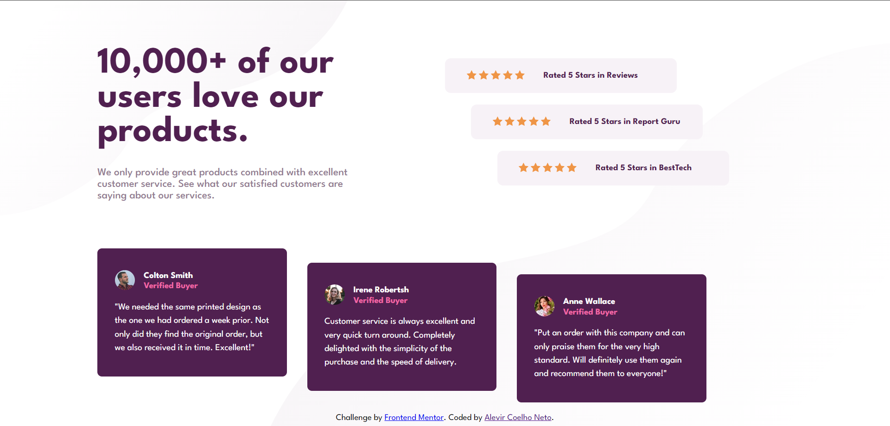

# Frontend Mentor - Social proof section solution

This is a solution to the [Social proof section challenge on Frontend Mentor](https://www.frontendmentor.io/challenges/social-proof-section-6e0qTv_bA). Frontend Mentor challenges help you improve your coding skills by building realistic projects. 

## Table of contents

- [Overview](#overview)
  - [The challenge](#the-challenge)
  - [Screenshot](#screenshot)
  - [Links](#links)
- [My process](#my-process)
  - [Built with](#built-with)
  - [Continued development](#continued-development)
  - [Useful resources](#useful-resources)
- [Author](#author)

## Overview

### The challenge

Users should be able to:

- View the optimal layout for the section depending on their device's screen size

### Screenshot

### Links

- Solution URL: [repository](https://github.com/Alevir-Coelho-Neto/Frontend-Mentor---Social-proof-section-solution?tab=readme-ov-file)
- Live Site URL: [site](https://frontend-mentor-social-proof-section-solution-seven.vercel.app/)

## My process

### Built with

- Semantic HTML5 markup
- CSS custom properties
- Flexbox
- CSS Grid
- Mobile-first workflow

### Useful resources

- [Google Fonts](https://fonts.google.com/) - This helped me to use external fonts instead of local ones, so that everyone can identify the type of font I used for this challenge.

## Author

- Website - [Portfolio](https://alevir-coelho-portfolio.vercel.app/)
- Frontend Mentor - [@Alevir-Coelho-Neto](https://www.frontendmentor.io/profile/Alevir-Coelho-Neto)
- Instagram - [@levi.devs](https://www.instagram.com/levi.devs/)

